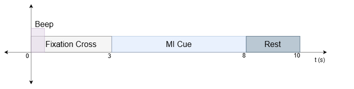

# MindRove Dataset Recording Program

This project provides a recording program for creating EEG-based Motor Imagrey (MI) datasets using the Arc headset from [MindRove Kft.](https://mindrove.com/arc/).
It was used to record 6 participants while performing 4 classes of MI: right hand, left hand, both feet, and tongue. A user interface instructs the participant by means of visual and auditory cues when to start performing MI while the EEG data transmitted from the Arc headset gets captured via the [Mindrove SDK](https://docs.mindrove.com/) library.
The dataset is provided with this repositry.

The arc headset is only capable of generating two trigger signals, thus to handle a 4-class paradigm, the recording was split into two files that handle two classes at one time.
Each recording __Run__ goes for 4 minutes, during which 24 trials are carried out, 12 for each class. The timing scheme of a single trial can be seen below.

In between each trial, a saline solution was applied on the scalp directly under each electrode, and the impedance was checked via the [MindRove Visualizer on Desktop](https://mindrove.com/downloads/) software. The visualizer's manual can be found [here](https://mindrove.com/wp-content/uploads/2023/04/UserManual_v2_3_2.pdf), and its important to switch back to the EEG mode from the Impedance mode before closing the visualizer, otherwise no EEG data will be transmitted during recording.

## How to use

- Setup a Conda env using the provided envornment.yml file
- Using Visual Studio Code with the created Conda env, the dataset_recorder_right_left.py and dataset_recorder_tongue_feet.py files can be used to start the recording of a single run.
- Adjust the subject_number and run_number variables accordingly
- Ensure a connection is made with the Arc headset and that its transmitting in EEG mode (green LED on)
- Run the program, it will last for 4 minutes
- The recordings will be saved to a CSV file in a folder in the same directory as the program

The first 6 coloumns of the CSV file corrospond to the C1, C2, C3, C4, C5, and C6 electrode positions provided by the Arc headset, while the last column represents the trigger signals. The triggers are sent by the headset at the same time the visual cue is shown on the screen. For right and left hand runs, the trigger values 1 and 2 corrospond to right and left hand MI respectively. While for both feet and tongue runs, the trigger signals 1 and 2 corrospond to tongue and both feet MI respectively.

